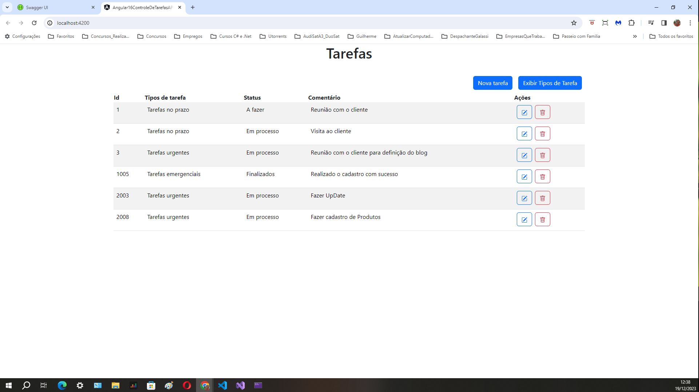

# Sistema de Controle de Tarefas 
## ( API, C#, ASP, HTML, CSS, JAVASCRIPT, ANGULAR e BOOTSTRAP )
 
<h1 align="center">
    
</h1>
 

## Introdução
O Sistema de Controle de Tarefas é uma aplicação desenvolvida para gerenciar tarefas, utilizando Angular 13, BootStrap para o frontend, .NET Entity Framework 6 para o backend e SQL Server para o armazenamento de dados.
## Funcionalidades Principais
CRUD de Tarefas: Permite criar, ler, atualizar e deletar tarefas.
Gerenciamento de Tipos de Tarefa: Possibilita a criação e edição de diferentes tipos de tarefas.
Controle de Status: Gerencia o status das tarefas, permitindo categorizá-las de acordo com seu progresso.
## Tecnologias Utilizadas
Frontend
Angular 13: Framework JavaScript/TypeScript para construção da interface do usuário.
Backend
.NET Entity Framework 6: ORM (Object-Relational Mapping) para interagir com o banco de dados SQL Server.
C#: Linguagem de programação utilizada para desenvolver a lógica do backend.
Banco de Dados
SQL Server: Banco de dados relacional utilizado para armazenar informações sobre tarefas, tipos de tarefa e status.
# Estrutura do Banco de Dados
## Tabelas
Tarefa: Armazena informações sobre as tarefas, como título, descrição, tipo de tarefa e status.
Tipo de Tarefa: Contém os diferentes tipos de tarefas disponíveis, como "Trabalho", "Estudo", etc.
Status: Define os possíveis status das tarefas, como "Pendente", "Em Progresso", "Concluída", entre outros.
# Uso das Ferramentas
# IDE
Visual Studio 2022 e Visual Studio Code

# Bootstrap
Versão 5.3.2

# Angular 13
O frontend foi desenvolvido utilizando Angular 13 para criar uma interface amigável e responsiva para os usuários. Utilizamos componentes, serviços e roteamento para facilitar a navegação e interação do usuário com as tarefas.

# .NET Entity Framework 6
O backend foi construído em C# com o auxílio do .NET Entity Framework 6 para realizar operações CRUD (Create, Read, Update, Delete) no banco de dados. Foram criados modelos de dados correspondentes às tabelas do banco para mapeamento das entidades.

# SQL Server
O SQL Server foi escolhido para armazenar os dados do sistema. As tabelas foram estruturadas de acordo com as necessidades das entidades envolvidas (Tarefa, Tipo de Tarefa e Status), garantindo integridade e consistência dos dados.

## Controle de Tarefas
O sistema permite aos usuários:

Criar novas tarefas, atribuindo-lhes um título, descrição, tipo e status.
Visualizar detalhes de cada tarefa, incluindo seu status atual e tipo associado.
Atualizar informações das tarefas existentes, como título, descrição, tipo e status.
Remover tarefas que não são mais necessárias.
O tipo de tarefa auxilia na categorização das atividades, enquanto o status permite acompanhar o progresso de cada tarefa.
